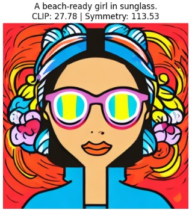

# Avatar-Generation-Using-Diffusion-Models

This project demonstrates how **Stable Diffusion** can be adapted to generate **cartoon-style avatars** from natural language prompts.
It combines **prompt engineering**, **controlled noise injection**, and **automated evaluation metrics** to create expressive, symmetrical, and stylistically consistent avatars.

---

## Project Overview

The goal of this project is to generate **high-quality, illustrated avatars** that visually match text descriptions.
Unlike standard image generation, avatar creation requires:

* Stylistic coherence
* Facial symmetry
* Alignment with user intent

To achieve that, the notebook implements:

1. **Prompt Engineering** – templates that steer the model toward artistic, avatar-like outputs.
2. **Controlled Noise Injection** – introduces variety without retraining the model.
3. **Evaluation Metrics** – measures quality using CLIP similarity, face detection, and symmetry scoring.

---

## How It Works

1. **Input a text prompt** (e.g., *“a fairy with butterfly wings and glowing skin”*)
2. The system wraps it in a stylized template, e.g.

   > “high-quality cartoon avatar of {prompt}, digital art, vibrant colors, symmetrical face, studio lighting.”
3. **Stable Diffusion v1.5** (via Hugging Face’s `diffusers`) generates the image.
4. The image is **evaluated** using CLIP similarity, Haar-based face detection, and a custom symmetry metric.

---

## Technologies Used

* **Stable Diffusion v1.5** (Hugging Face Diffusers)
* **OpenAI CLIP** for semantic similarity
* **OpenCV** for face detection
* **PyTorch**, **NumPy**, and **Matplotlib** for inference and visualization

---

## Setup Instructions

### 1. Clone this repository

```bash
git clone https://github.com/tasneemhesham/Avatar-Generation-Using-Diffusion-Models.git
cd Avatar-Generation-Using-Diffusion-Models
```

### 2. Install dependencies

   Install all required packages listed in the `requirements.txt` file:

   ```bash
   pip install -r requirements.txt
   ```
   If you prefer, you can install them manually using `pip install` for each package.

### 3. Run the Notebook

```bash
jupyter notebook avatar_generation.ipynb
```
---

## Sample Results

<p align="center">
   
   
   
</p>
<p align="center">
   
   
   
</p>
<p align="center">
   
   
   
</p>

---

## Evaluation Metrics

| Metric             | Description                                               |
| ------------------ | --------------------------------------------------------- |
| **CLIP Score**     | Measures how well the image matches the text description. |
| **Face Detection** | Checks if a clear face is detected using Haar cascades.   |
| **Symmetry Score** | Quantifies how symmetrical the face is.                   |

---

## Future Enhancements

* Fine-tuning Stable Diffusion on custom avatar datasets
* Integrating emotion and pose control via textual conditioning
* Adding user feedback–driven evaluation
